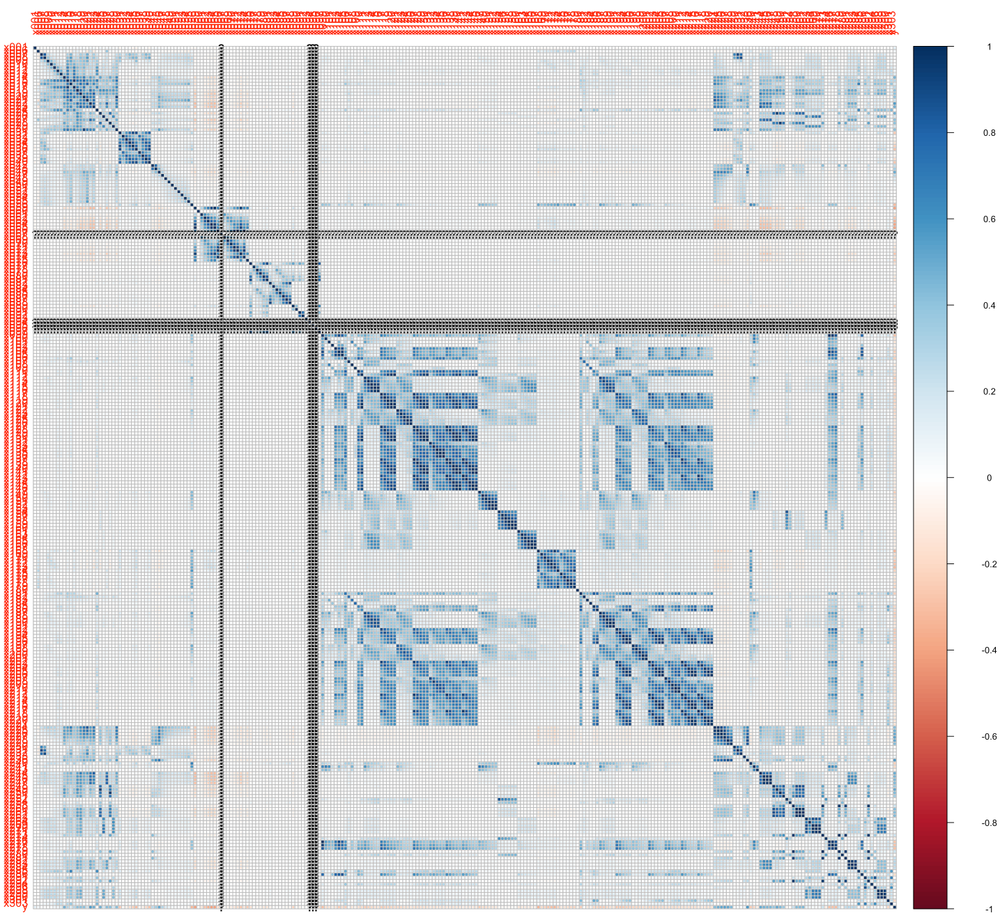
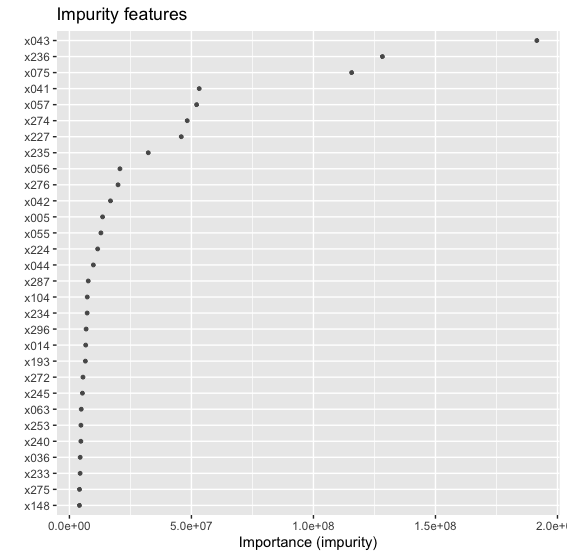

```{r setup, include=FALSE}
knitr::opts_chunk$set(echo = TRUE)
```

### Global assumptions

These are the assumptions that were considering no matter which strategies to use:

- There is a relationship between the features and the target variable `y`
- The error are not conditionally related, meaning that the measure of one value does not affect the next. (As the case for timeseries)
- The underlying distribution of the features remains the same.

### Data preprocessing

All strategies describe bellow preprocess the data in the following way:

- Locate the features that are categorical (contains 2 discrete values).
- Remove zero and near zero variance features.
- Mode impute for missing nominal values
- Mean inmpute for missing numerical values
- Apply Yeo-Johnson to normalize the features

Other method were use unfortunately unsucessfully due to be unfeasably slow, a more advance imputation technique (knn or bagging) may improve the current model, but the computation was too slow. Another treatment to the data that was tested was a feature reduction using PCA unfortunately it didn't render better result overall.

### Linear strategies, too naive?

Right off the start of any problem I've always like with the simplest solution which is linear regression techniques, considering the vast numbers of features I was concerned firstly on the collinearity problems that may arise and that this approach will probably not be very suitable for this dataset, eitherway it's a relatively easy/fast technique to trained and help in peaking out at what the data look like (data preprocessing). Here is a summary of things I learned by using linear approaches to this dataset:

- Assumption four assumption for the regression to be useful are not met, particularly multilinearity, homoscedasticity and linear relationship accross the data, to proof this I wanted to see how would a graph correlation matrix would look like for this dataset




- Other expansion methods from linear regression like ridge/lasso and elastic nets were not at all useful and provided little to no improvement in accuracy, peaking at around for the best model 4%.

- There are quite a bit of missing and highly correlated data between features, this could suggest either randomly missing data for some features or redundant features that are not providing too much information, by trying to do a manual cleaning of the data I encounter that it was starting to get out of hand, and I corrected this on `random_forest_model.R` and `neural_network.R`

### Neural network (1 layer) and gridsearch

Neural network might be more suitable for this problem considering the nature of general function approximator, unfortunately even when 1 or 2 layer network did improve upon the linear approaches it got consistenly stuck in an accuraccy between 14-20%. A grid search of different layers weight sizes with early stop configuration was unable to improve further this result. The best neural network model is store in `model/neural_network/` 


### Random forest approach

Random forest turns to be the model that provided the best result so far which include a accuracy above 35%, not very impresive but still an improvement upon the models above, a grid search was perform in order to find the best tune in parameter for best tree model. It is likely that the mean imputation had a negative impact upon the decision, given more time probably the preprocessing pipeline requires a throughput improvement when values are missing.




